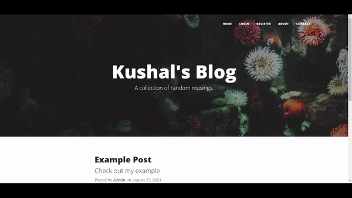

# Blog Website

## Description

This is a blog website created using Python Flask, CKEditor, WTForms, SQLAlchemy, JavaScript, and HTML. The website includes the following features:

- **User Authentication:** Users can register, log in, and log out.
- **Commenting System:** Logged-in users can comment on blog posts.
- **Admin Functionality:** A secret admin has the ability to create, edit, and delete blog posts.

You can visit the website at [Blog_Website](https://blogwebsite-vqrn.onrender.com/).

## Features

- **User Login:** Secure login and registration for users.
- **Comments:** Logged-in users can add comments to posts.
- **Admin Panel:** Admin can manage blog posts (create, edit, delete).
- **Rich Text Editor:** CKEditor is used for creating and editing blog posts.
- **Responsive Design:** The website is designed to be responsive and user-friendly.

## Technologies Used

- **Python Flask:** Web framework for building the application.
- **CKEditor:** Rich text editor for blog post content.
- **WTForms:** Form handling and validation.
- **SQLAlchemy:** ORM for database interactions.
- **JavaScript:** Client-side scripting.
- **HTML/CSS:** Markup and styling for the website.

  

